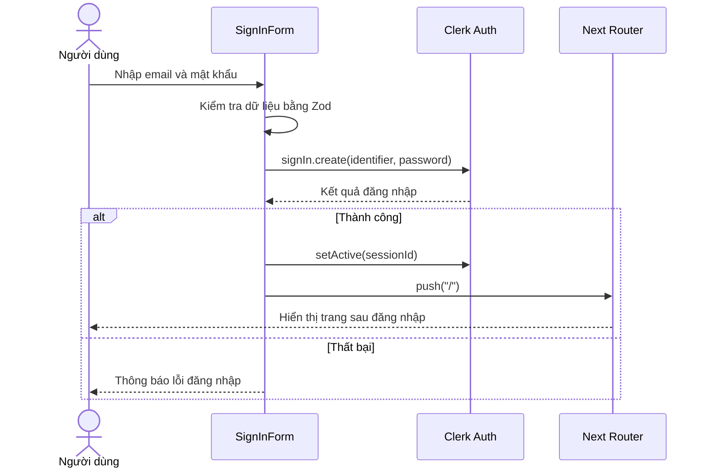
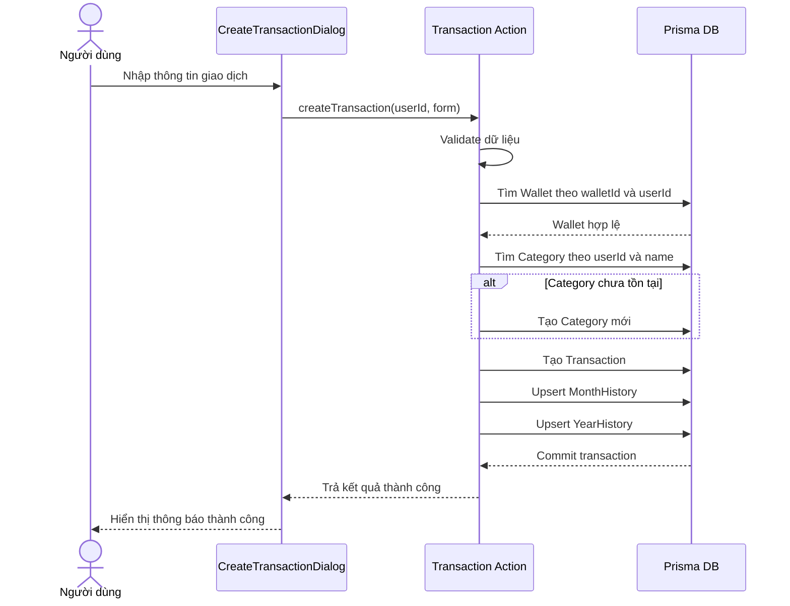
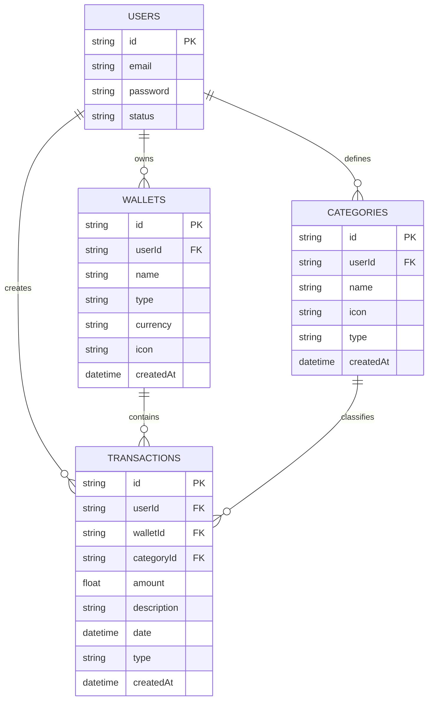
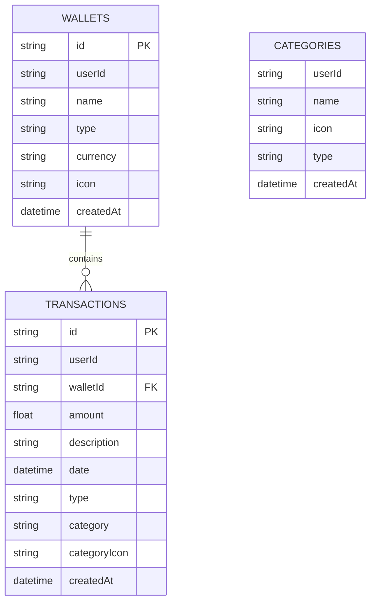

# Báo Cáo Core Nghiệp Vụ - Money Lover Clone

## 1. Phạm vi phân công

Tài liệu này tổng hợp phần core cho báo cáo dự án, tập trung vào 3 nghiệp vụ chính:

- Đăng ký, đăng nhập
- Quản lý ví
- Quản lý giao dịch

Phạm vi phân tích chính gồm:

- UC Specification: `UC-Login`, `UC-ManageWallet`, `UC-ManageTransaction`
- Entity core: `User`, `Wallet`, `Transaction`, `Category`
- Relationship core
- Analysis Class và Detailed Design cho 4 lớp core
- Sequence Diagram cho đăng nhập và thêm giao dịch cá nhân
- ERD core
- Test case core

Lưu ý theo code hiện tại:

- Xác thực người dùng được quản lý bởi `Clerk`, nên trong Prisma hiện tại không có bảng `User` nội bộ.
- Quan hệ `Transaction - Category` trong code hiện tại là quan hệ logic thông qua trường `category` và `categoryIcon`, chưa dùng `categoryId` làm khóa ngoại.
- Hệ thống còn có `Budget`, `Goal`, `Loan`, `Notification`, nhưng không nằm trong phạm vi core của tài liệu này.

## 2. Mô tả nghiệp vụ core

### 2.1. Nghiệp vụ đăng ký, đăng nhập

Hệ thống cho phép người dùng tạo tài khoản bằng email và mật khẩu. Sau khi đăng ký, người dùng phải xác minh email bằng mã 6 chữ số. Khi đăng nhập thành công, hệ thống tạo session và cho phép truy cập các chức năng cá nhân. Các route quan trọng được bảo vệ bằng middleware; nếu chưa xác thực thì hệ thống điều hướng về trang đăng nhập.

### 2.2. Nghiệp vụ quản lý ví

Mỗi người dùng có thể tạo nhiều ví để quản lý các nguồn tiền khác nhau như tiền mặt, tài khoản ngân hàng, ví điện tử, thẻ tín dụng. Mỗi ví có tên, loại, đơn vị tiền tệ và biểu tượng đại diện. Hệ thống cho phép tạo, xem danh sách, cập nhật và xóa ví. Số dư ví được tính dựa trên tổng thu trừ tổng chi của các giao dịch thuộc ví đó.

### 2.3. Nghiệp vụ quản lý giao dịch

Người dùng có thể ghi nhận giao dịch thu hoặc chi. Mỗi giao dịch thuộc về một ví, có số tiền, ngày phát sinh, mô tả, loại giao dịch và danh mục. Khi thêm giao dịch, hệ thống kiểm tra ví có tồn tại và thuộc về đúng người dùng hay không. Nếu danh mục chưa tồn tại, hệ thống có thể tạo mới danh mục. Sau khi lưu giao dịch, hệ thống cập nhật lịch sử tổng hợp theo ngày và theo tháng để phục vụ thống kê báo cáo.

## 3. Yêu cầu chức năng

### 3.1. Yêu cầu đăng ký, đăng nhập

- Hệ thống cho phép đăng ký bằng email và mật khẩu.
- Mật khẩu phải dài tối thiểu 8 ký tự.
- Email phải đúng định dạng.
- Sau đăng ký, hệ thống gửi mã xác minh email.
- Hệ thống cho phép đăng nhập bằng email và mật khẩu.
- Nếu đăng nhập thành công, hệ thống tạo session.
- Nếu chưa đăng nhập mà truy cập trang riêng tư, hệ thống chuyển hướng đến trang đăng nhập.

### 3.2. Yêu cầu quản lý ví

- Người dùng tạo ví mới.
- Người dùng xem danh sách ví của chính mình.
- Người dùng cập nhật thông tin ví.
- Người dùng xóa ví.
- Hệ thống tính được số dư của từng ví.

### 3.3. Yêu cầu quản lý giao dịch

- Người dùng tạo giao dịch thu.
- Người dùng tạo giao dịch chi.
- Mỗi giao dịch phải gắn với một ví.
- Mỗi giao dịch có danh mục.
- Người dùng xem lịch sử giao dịch theo khoảng thời gian.
- Người dùng xóa giao dịch.
- Hệ thống cập nhật dữ liệu tổng hợp sau khi tạo hoặc xóa giao dịch.

## 4. UC Specification

### 4.1. UC-Login

| Mục | Nội dung |
| --- | --- |
| Mã use case | UC-Login |
| Tên use case | Đăng nhập hệ thống |
| Tác nhân | Người dùng |
| Mục tiêu | Đăng nhập để sử dụng các chức năng cá nhân |
| Tiền điều kiện | Người dùng đã có tài khoản hợp lệ |
| Hậu điều kiện | Session đăng nhập được tạo, người dùng vào hệ thống |
| Kích hoạt | Người dùng nhấn nút Sign in |

#### Luồng chính

1. Người dùng mở màn hình đăng nhập.
2. Người dùng nhập email và mật khẩu.
3. Hệ thống kiểm tra dữ liệu đầu vào.
4. Hệ thống gửi thông tin đăng nhập đến dịch vụ xác thực.
5. Dịch vụ xác thực xác nhận thông tin hợp lệ.
6. Hệ thống tạo session đăng nhập.
7. Hệ thống chuyển người dùng đến trang chủ hoặc dashboard.

#### Luồng ngoại lệ

1. Email sai định dạng.
2. Mật khẩu ngắn hơn 8 ký tự.
3. Tài khoản không tồn tại hoặc sai mật khẩu.
4. Lỗi mạng hoặc lỗi dịch vụ xác thực.

#### Quy tắc nghiệp vụ

- Email phải đúng định dạng.
- Mật khẩu phải có tối thiểu 8 ký tự.
- Người dùng chưa xác thực không được vào các trang cần bảo vệ.

### 4.2. UC-ManageWallet

| Mục | Nội dung |
| --- | --- |
| Mã use case | UC-ManageWallet |
| Tên use case | Quản lý ví |
| Tác nhân | Người dùng |
| Mục tiêu | Tạo và quản lý các ví tài chính cá nhân |
| Tiền điều kiện | Người dùng đã đăng nhập |
| Hậu điều kiện | Dữ liệu ví được tạo, sửa, xóa hoặc hiển thị thành công |
| Kích hoạt | Người dùng vào trang Wallets |

#### Luồng chính - Tạo ví

1. Người dùng mở chức năng tạo ví.
2. Hệ thống hiện form nhập tên, loại ví, tiền tệ, icon.
3. Người dùng nhập thông tin và gửi yêu cầu.
4. Hệ thống kiểm tra hợp lệ dữ liệu.
5. Hệ thống lưu ví vào cơ sở dữ liệu.
6. Hệ thống thông báo tạo ví thành công.
7. Hệ thống cập nhật danh sách ví.

#### Luồng chính - Cập nhật ví

1. Người dùng chọn một ví cần sửa.
2. Hệ thống hiển thị thông tin hiện tại.
3. Người dùng chỉnh sửa thông tin.
4. Hệ thống kiểm tra ví có thuộc về người dùng hay không.
5. Hệ thống cập nhật dữ liệu.
6. Hệ thống trả về kết quả thành công.

#### Luồng chính - Xóa ví

1. Người dùng chọn ví cần xóa.
2. Hệ thống kiểm tra ví tồn tại và thuộc về người dùng.
3. Hệ thống xóa ví.
4. Hệ thống cập nhật danh sách ví.

#### Luồng ngoại lệ

1. Dữ liệu tên ví rỗng.
2. Ví không tồn tại.
3. Ví không thuộc về người dùng hiện tại.
4. Xóa ví có thể ảnh hưởng dữ liệu giao dịch liên quan.

#### Quy tắc nghiệp vụ

- Tên ví không được rỗng.
- Loại ví thuộc tập giá trị: `cash`, `bank`, `e-wallet`, `credit-card`.
- Mỗi ví thuộc về đúng một người dùng.

### 4.3. UC-ManageTransaction

| Mục | Nội dung |
| --- | --- |
| Mã use case | UC-ManageTransaction |
| Tên use case | Quản lý giao dịch |
| Tác nhân | Người dùng |
| Mục tiêu | Ghi nhận thu chi và xem lịch sử giao dịch |
| Tiền điều kiện | Người dùng đã đăng nhập và có ít nhất một ví |
| Hậu điều kiện | Giao dịch được tạo, hiển thị hoặc xóa thành công |
| Kích hoạt | Người dùng vào trang Transactions hoặc History |

#### Luồng chính - Thêm giao dịch

1. Người dùng chọn thêm giao dịch thu hoặc chi.
2. Hệ thống hiện form nhập số tiền, ngày, mô tả, danh mục, ví.
3. Người dùng nhập thông tin và gửi yêu cầu.
4. Hệ thống kiểm tra hợp lệ dữ liệu.
5. Hệ thống kiểm tra ví tồn tại và thuộc về người dùng.
6. Hệ thống kiểm tra danh mục, nếu chưa có thì tạo mới.
7. Hệ thống lưu giao dịch.
8. Hệ thống cập nhật thống kê theo ngày và theo tháng.
9. Hệ thống thông báo thành công.

#### Luồng chính - Xem lịch sử giao dịch

1. Người dùng chọn khoảng thời gian cần xem.
2. Hệ thống truy vấn danh sách giao dịch theo user và khoảng thời gian.
3. Hệ thống hiển thị giao dịch theo thứ tự mới nhất đến cũ nhất.

#### Luồng chính - Xóa giao dịch

1. Người dùng chọn một giao dịch.
2. Hệ thống xác nhận giao dịch thuộc về người dùng.
3. Hệ thống xóa giao dịch.
4. Hệ thống giảm trừ số liệu tổng hợp tháng và năm tương ứng.
5. Hệ thống cập nhật lại màn hình lịch sử.

#### Luồng ngoại lệ

1. Số tiền không hợp lệ hoặc nhỏ hơn hoặc bằng 0.
2. Chưa chọn ví.
3. Ví không tồn tại.
4. Chưa nhập ngày hợp lệ.
5. Lỗi khi cập nhật thống kê tổng hợp.

#### Quy tắc nghiệp vụ

- Số tiền phải lớn hơn 0.
- Giao dịch phải thuộc một trong hai loại: `income`, `expense`.
- Mỗi giao dịch phải gắn với một ví.
- Giao dịch chỉ được thao tác bởi chủ sở hữu.

## 5. Entity core

### 5.1. User

- Đại diện cho người sử dụng hệ thống.
- Có các thuộc tính cơ bản như `id`, `email`, `password`, `status`.
- Trong code hiện tại, `User` được quản lý bởi Clerk; CSDL nội bộ chỉ lưu `userId` trong các bảng liên quan.

### 5.2. Wallet

- Đại diện cho nơi lưu trữ tiền của người dùng.
- Thuộc tính chính: `id`, `userId`, `name`, `type`, `currency`, `icon`, `createdAt`.

### 5.3. Transaction

- Đại diện cho một phát sinh thu chi.
- Thuộc tính chính: `id`, `amount`, `description`, `date`, `type`, `category`, `categoryIcon`, `walletId`, `userId`, `createdAt`.

### 5.4. Category

- Đại diện cho nhóm giao dịch.
- Thuộc tính chính: `name`, `icon`, `type`, `userId`, `createdAt`.
- Dùng để phân loại thu và chi.

## 6. Relationship

### 6.1. User - Wallet

- Một `User` có thể sở hữu nhiều `Wallet`.
- Một `Wallet` chỉ thuộc về một `User`.
- Cardinality: `1 - n`.

### 6.2. Wallet - Transaction

- Một `Wallet` có thể có nhiều `Transaction`.
- Một `Transaction` bắt buộc thuộc về một `Wallet`.
- Cardinality: `1 - n`.

### 6.3. Transaction - Category

- Về nghiệp vụ, một `Transaction` thuộc một `Category`.
- Một `Category` có thể được gắn cho nhiều `Transaction`.
- Cardinality: `1 - n`.
- Theo code hiện tại, quan hệ này đang là logic relation, vì bảng `Transaction` lưu trực tiếp `category` và `categoryIcon`, không lưu `categoryId`.

## 7. Analysis Class

### 7.1. Class User

| Thuộc tính | Kiểu | Ý nghĩa |
| --- | --- | --- |
| id | String | Mã người dùng |
| email | String | Email đăng nhập |
| password | String | Mật khẩu đã mã hóa |
| status | String | Trạng thái tài khoản |

| Phương thức | Ý nghĩa |
| --- | --- |
| signUp() | Đăng ký tài khoản |
| signIn() | Đăng nhập hệ thống |
| signOut() | Đăng xuất |
| verifyEmail() | Xác minh email |

### 7.2. Class Wallet

| Thuộc tính | Kiểu | Ý nghĩa |
| --- | --- | --- |
| id | String | Mã ví |
| userId | String | Mã chủ sở hữu |
| name | String | Tên ví |
| type | String | Loại ví |
| currency | String | Đơn vị tiền tệ |
| icon | String | Biểu tượng ví |
| createdAt | DateTime | Ngày tạo |

| Phương thức | Ý nghĩa |
| --- | --- |
| createWallet() | Tạo ví mới |
| updateWallet() | Cập nhật ví |
| deleteWallet() | Xóa ví |
| getWallets() | Lấy danh sách ví |
| getBalance() | Tính số dư ví |

### 7.3. Class Transaction

| Thuộc tính | Kiểu | Ý nghĩa |
| --- | --- | --- |
| id | String | Mã giao dịch |
| userId | String | Mã người dùng |
| walletId | String | Mã ví |
| amount | Float | Số tiền |
| description | String | Mô tả |
| date | DateTime | Ngày giao dịch |
| type | String | Thu hoặc chi |
| category | String | Tên danh mục |
| categoryIcon | String | Biểu tượng danh mục |

| Phương thức | Ý nghĩa |
| --- | --- |
| createTransaction() | Tạo giao dịch |
| getTransactionsHistory() | Lấy lịch sử giao dịch |
| deleteTransaction() | Xóa giao dịch |
| validateWallet() | Kiểm tra ví hợp lệ |
| updateSummary() | Cập nhật bảng tổng hợp |

### 7.4. Class Category

| Thuộc tính | Kiểu | Ý nghĩa |
| --- | --- | --- |
| name | String | Tên danh mục |
| icon | String | Biểu tượng |
| type | String | Loại danh mục |
| userId | String | Chủ sở hữu |
| createdAt | DateTime | Ngày tạo |

| Phương thức | Ý nghĩa |
| --- | --- |
| createCategory() | Tạo danh mục |
| findCategory() | Tìm danh mục |
| listCategories() | Lấy danh sách danh mục |

## 8. Sequence Diagram

### 8.1. Đăng nhập

### 8.2. Thêm giao dịch cá nhân

## 9. Detailed Design

### 9.1. Detailed class User

| Thuộc tính | Kiểu | Ràng buộc |
| --- | --- | --- |
| id | String | Duy nhất |
| email | String | Đúng định dạng email |
| password | String | Tối thiểu 8 ký tự |
| isVerified | Boolean | Đã xác minh email hay chưa |

| Hàm | Đầu vào | Đầu ra | Mô tả |
| --- | --- | --- | --- |
| signUp(email, password) | Email, password | User/Status | Tạo tài khoản mới |
| signIn(email, password) | Email, password | Session/Status | Đăng nhập |
| verifyEmail(code) | Mã xác minh | Boolean | Xác minh email |
| signOut() | None | Boolean | Kết thúc phiên đăng nhập |

### 9.2. Detailed class Wallet

| Thuộc tính | Kiểu | Ràng buộc |
| --- | --- | --- |
| id | String | Duy nhất |
| userId | String | Bắt buộc |
| name | String | Không rỗng, max 50 |
| type | String | cash, bank, e-wallet, credit-card |
| currency | String | Mặc định VND |
| icon | String | Có giá trị mặc định |

| Hàm | Đầu vào | Đầu ra | Mô tả |
| --- | --- | --- | --- |
| createWallet(form) | Wallet data | Wallet | Tạo ví mới |
| getWallets(userId) | userId | List<Wallet> | Lấy danh sách ví |
| getWalletById(id, userId) | id, userId | Wallet | Tìm ví theo mã |
| updateWallet(form) | Wallet data | Wallet | Cập nhật ví |
| deleteWallet(userId, walletId) | userId, walletId | Boolean | Xóa ví |
| getWalletBalance(walletId, userId) | walletId, userId | Balance DTO | Tính số dư |

### 9.3. Detailed class Transaction

| Thuộc tính | Kiểu | Ràng buộc |
| --- | --- | --- |
| id | String | Duy nhất |
| amount | Float | > 0 |
| description | String | Có thể rỗng |
| date | DateTime | Bắt buộc |
| category | String | Bắt buộc |
| type | String | income hoặc expense |
| walletId | String | Bắt buộc |
| userId | String | Bắt buộc |

| Hàm | Đầu vào | Đầu ra | Mô tả |
| --- | --- | --- | --- |
| createTransaction(form) | Transaction data | Status | Tạo giao dịch mới |
| getTransactionsHistory(from, to, userId) | Khoảng ngày, userId | List<Transaction> | Lấy lịch sử |
| deleteTransaction(id) | transactionId | Status | Xóa giao dịch |
| getBalanceStats(userId, from, to) | userId, từ ngày, đến ngày | Stats | Tính tổng thu chi |

### 9.4. Detailed class Category

| Thuộc tính | Kiểu | Ràng buộc |
| --- | --- | --- |
| name | String | Không rỗng |
| userId | String | Bắt buộc |
| icon | String | Bắt buộc |
| type | String | income hoặc expense |

| Hàm | Đầu vào | Đầu ra | Mô tả |
| --- | --- | --- | --- |
| createCategory(data) | Category data | Category | Tạo danh mục |
| findCategory(userId, name) | userId, name | Category | Tìm danh mục |
| listCategories(userId) | userId | List<Category> | Lấy danh mục theo user |

## 10. ERD core

### 10.1. Mô tả ERD logic

- `users` quản lý thông tin tài khoản.
- `wallets` thuộc về `users`.
- `transactions` thuộc về `wallets` và `users`.
- `categories` thuộc về `users` và được gắn cho `transactions`.

### 10.2. ERD để đưa vào báo cáo

### 10.3. Ghi chú khi đối chiếu với code hiện tại

- Trong code hiện tại, Prisma chưa có bảng `users`, vì người dùng được quản lý bởi Clerk.
- Bảng `categories` trong schema hiện tại chưa có trường `id`.
- Bảng `transactions` trong schema hiện tại chưa có `categoryId`, thay vào đó lưu `category` và `categoryIcon`.

Nếu giảng viên yêu cầu ERD "đúng với code", có thể trình bày thêm một ERD vật lý như sau:

## 11. Test case core

### 11.1. Nhóm Auth

| TC ID | Tên test case | Tiền điều kiện | Bước thực hiện | Kết quả mong đợi |
| --- | --- | --- | --- | --- |
| TC-AUTH-01 | Đăng ký hợp lệ | Chưa có tài khoản | Nhập email hợp lệ và mật khẩu >= 8 ký tự, nhấn đăng ký | Tạo tài khoản thành công, điều hướng tới xác minh email |
| TC-AUTH-02 | Đăng ký email sai định dạng | Chưa có tài khoản | Nhập email sai định dạng | Hệ thống báo lỗi email |
| TC-AUTH-03 | Đăng ký mật khẩu ngắn | Chưa có tài khoản | Nhập mật khẩu < 8 ký tự | Hệ thống báo lỗi mật khẩu |
| TC-AUTH-04 | Đăng nhập hợp lệ | Đã có tài khoản | Nhập đúng email và mật khẩu | Đăng nhập thành công, vào hệ thống |
| TC-AUTH-05 | Đăng nhập sai mật khẩu | Đã có tài khoản | Nhập sai mật khẩu | Hệ thống báo lỗi đăng nhập |
| TC-AUTH-06 | Truy cập route bảo vệ khi chưa đăng nhập | Chưa có session | Mở trang wallets hoặc transactions | Hệ thống điều hướng tới `/signin` |

### 11.2. Nhóm Wallet

| TC ID | Tên test case | Tiền điều kiện | Bước thực hiện | Kết quả mong đợi |
| --- | --- | --- | --- | --- |
| TC-WALLET-01 | Tạo ví hợp lệ | Đã đăng nhập | Nhập tên ví, loại, tiền tệ, icon hợp lệ | Tạo ví thành công |
| TC-WALLET-02 | Tạo ví thiếu tên | Đã đăng nhập | Bỏ trống tên ví | Hệ thống báo lỗi validation |
| TC-WALLET-03 | Xem danh sách ví | Đã đăng nhập, đã có ví | Mở trang Wallets | Hiển thị danh sách ví của user |
| TC-WALLET-04 | Cập nhật ví hợp lệ | Đã có ví | Sửa tên hoặc icon ví | Cập nhật thành công |
| TC-WALLET-05 | Xóa ví hợp lệ | Đã có ví | Chọn xóa ví | Ví bị xóa khỏi danh sách |
| TC-WALLET-06 | Tính số dư ví | Đã có giao dịch thu chi | Xem thông tin ví | Số dư = tổng thu - tổng chi |

### 11.3. Nhóm Transaction

| TC ID | Tên test case | Tiền điều kiện | Bước thực hiện | Kết quả mong đợi |
| --- | --- | --- | --- | --- |
| TC-TRANS-01 | Thêm giao dịch thu hợp lệ | Đã đăng nhập, đã có ví | Nhập amount > 0, chọn ví, category, date | Tạo giao dịch thu thành công |
| TC-TRANS-02 | Thêm giao dịch chi hợp lệ | Đã đăng nhập, đã có ví | Nhập dữ liệu hợp lệ cho expense | Tạo giao dịch chi thành công |
| TC-TRANS-03 | Thêm giao dịch không chọn ví | Đã đăng nhập | Bỏ trống wallet | Hệ thống báo lỗi wallet là bắt buộc |
| TC-TRANS-04 | Thêm giao dịch số tiền âm | Đã đăng nhập, đã có ví | Nhập amount <= 0 | Hệ thống báo lỗi validation |
| TC-TRANS-05 | Thêm giao dịch với category mới | Đã đăng nhập, đã có ví | Nhập danh mục chưa tồn tại | Hệ thống tạo category mới và lưu giao dịch |
| TC-TRANS-06 | Xem lịch sử giao dịch theo ngày | Đã đăng nhập, đã có giao dịch | Chọn from, to | Hiển thị giao dịch trong khoảng ngày |
| TC-TRANS-07 | Xóa giao dịch | Đã đăng nhập, đã có giao dịch | Chọn xóa giao dịch | Giao dịch bị xóa và tổng hợp được cập nhật |
| TC-TRANS-08 | Thêm giao dịch vào ví không thuộc user | Đăng nhập bằng user A | Gửi walletId của user B | Hệ thống từ chối và báo `Wallet not found` |

## 12. Gợi ý trình bày trong báo cáo

Nếu bạn cần nộp đúng chất "phần phân tích thiết kế", có thể trình bày theo cấu trúc:

1. Mô tả bài toán
2. Phạm vi core
3. Danh sách yêu cầu chức năng
4. Use case specification
5. Mô hình lớp phân tích
6. Sequence diagram
7. ERD
8. Test case

Nếu giảng viên hỏi "tại sao ERD và code khác nhau", có thể trả lời:

- ERD logic được dùng để mô hình hóa nghiệp vụ.
- Hệ thống hiện tại tích hợp dịch vụ xác thực Clerk nên không cần bảng `users` nội bộ.
- Quan hệ `Transaction - Category` đang được hiện thực tối ưu nhanh bằng cách lưu snapshot tên danh mục và icon ngay trên giao dịch.

## 13. Đối chiếu với code hiện tại

Tài liệu này được rút ra chủ yếu từ các thành phần sau:

- `prisma/schema.prisma`
- `lib/actions/wallets.ts`
- `lib/actions/transactions.ts`
- `lib/validations/auth.ts`
- `app/(auth)/_components/signin-form.tsx`
- `app/(auth)/_components/signup-form.tsx`
- `middleware.ts`

## 14. Kết luận ngắn

Phần core của hệ thống quản lý chi tiêu cá nhân gồm xác thực người dùng, quản lý ví và quản lý giao dịch. Ba nhóm chức năng này tạo nên luồng nghiệp vụ trung tâm: người dùng đăng nhập vào hệ thống, tạo các ví tài chính, sau đó ghi nhận các khoản thu chi theo danh mục để phục vụ quản lý số dư và thống kê chi tiêu.
