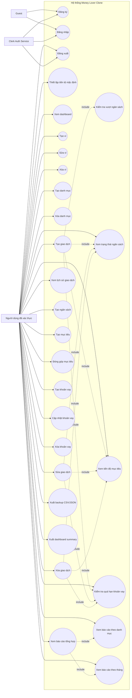
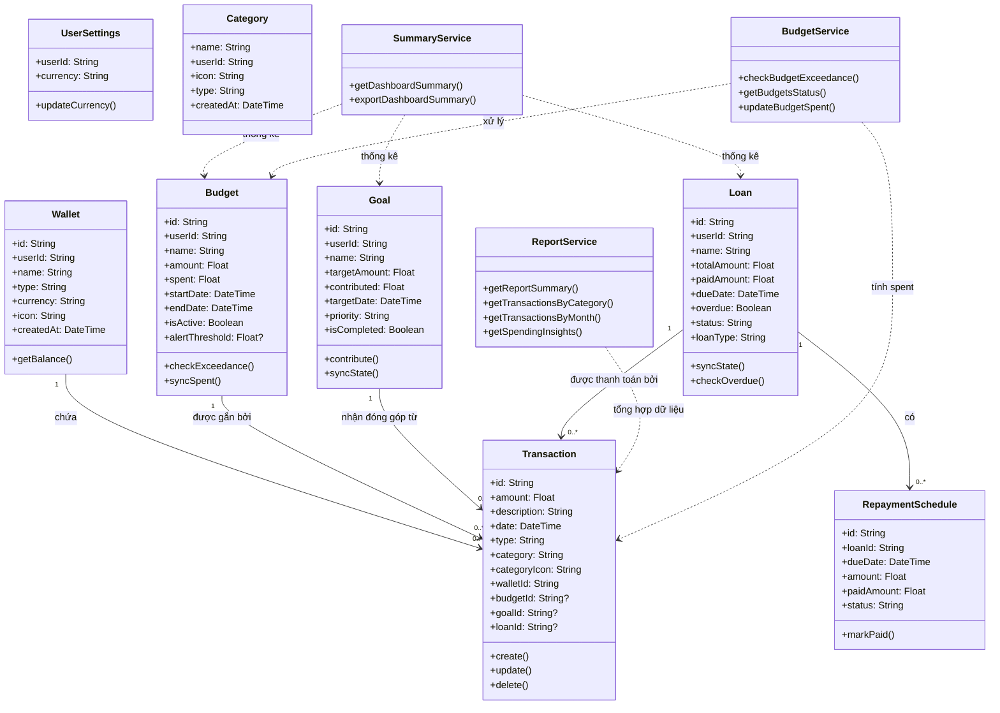
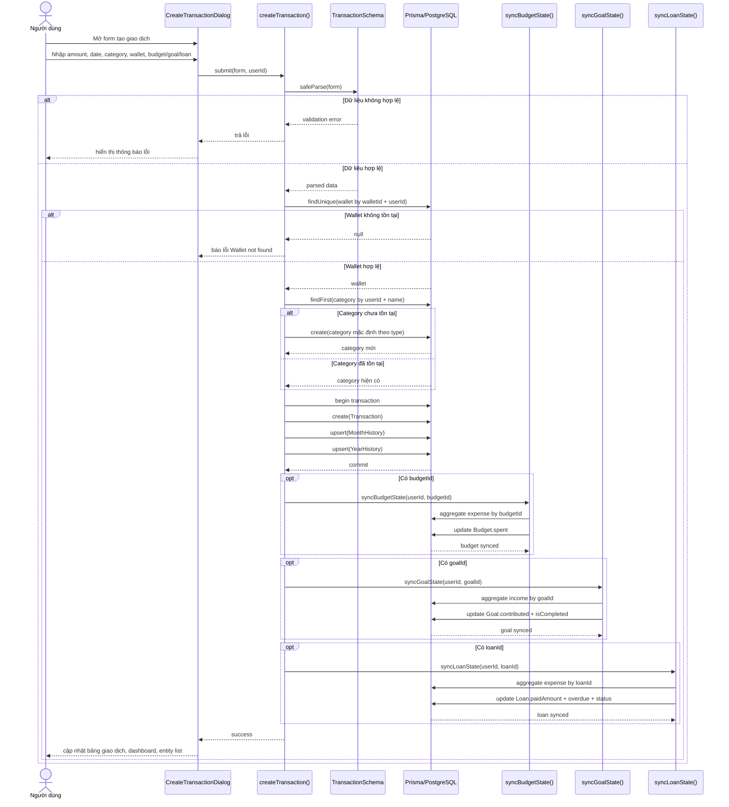
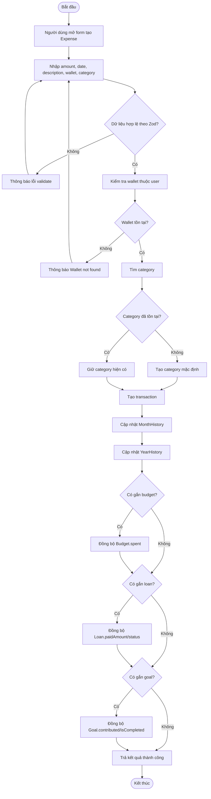
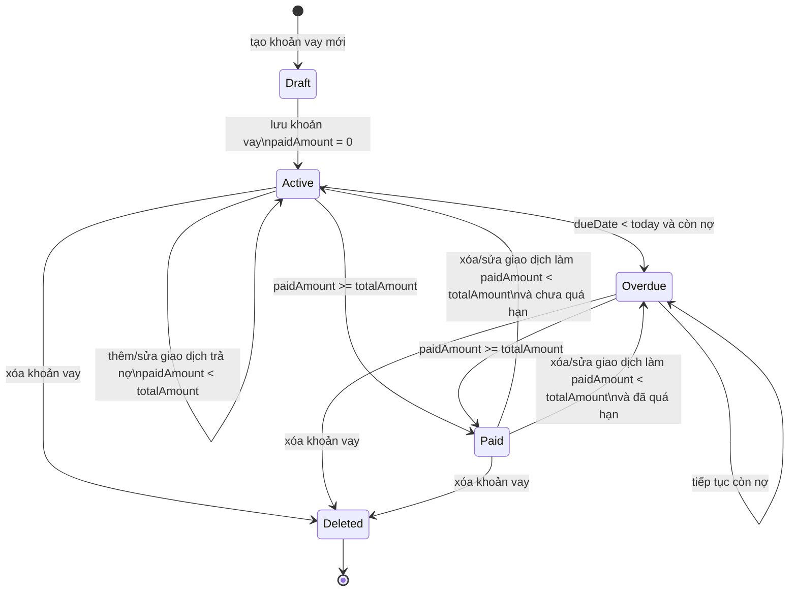
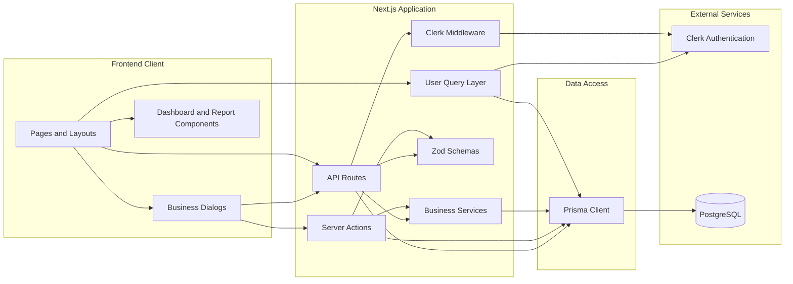
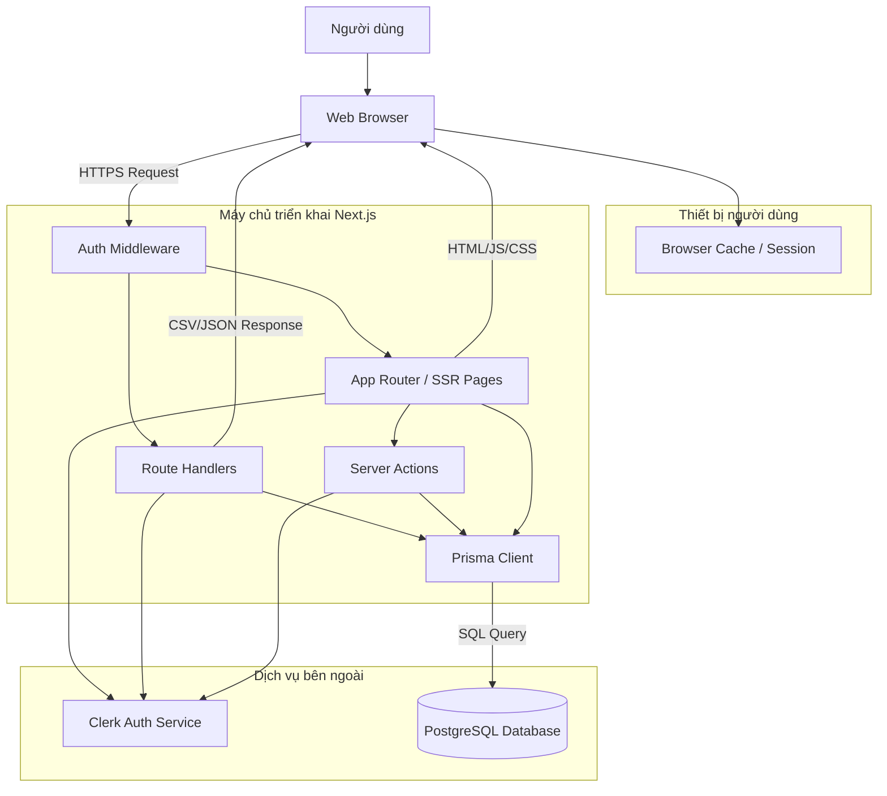
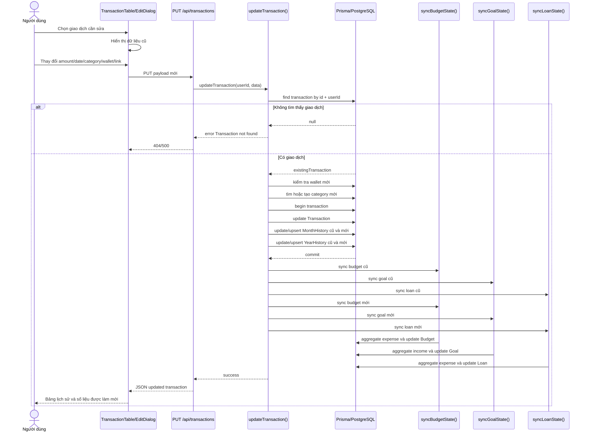
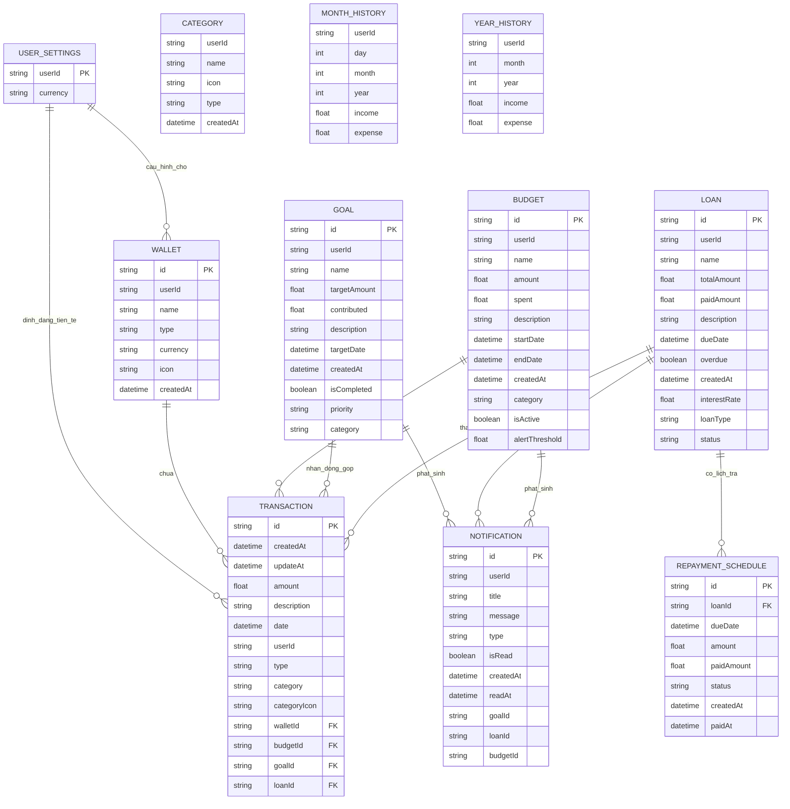

# BÁO CÁO PHÂN TÍCH VÀ THIẾT KẾ HỆ THỐNG

## Thông tin chung

- Tên đề tài: `Money Lover Clone - Hệ thống quản lý tài chính cá nhân`
- Nền tảng hiện tại: `Next.js 14 + React 18 + Prisma + PostgreSQL + Clerk`
- Phạm vi báo cáo: phân tích và thiết kế dựa trên mã nguồn hiện có trong repo `money-lover-clone`
- Thời điểm khảo sát mã nguồn: `07/05/2026`

---

## I. Mô tả hệ thống

### 1. Mô tả chung về hệ thống, lý do lựa chọn

`Money Lover Clone` là ứng dụng web quản lý tài chính cá nhân cho phép người dùng ghi nhận thu chi, quản lý ví tiền, theo dõi ngân sách, mục tiêu tiết kiệm, khoản vay và xem báo cáo tổng hợp. Hệ thống được xây dựng theo hướng full-stack web application, kết hợp giao diện người dùng, API server, xử lý nghiệp vụ và cơ sở dữ liệu trong cùng một dự án Next.js.

Hệ thống hiện tại tập trung vào bài toán cá nhân:

- Ghi nhận giao dịch thu và chi theo ngày.
- Phân loại giao dịch theo danh mục.
- Gán giao dịch vào ví, ngân sách, mục tiêu hoặc khoản vay.
- Tổng hợp lịch sử giao dịch theo ngày, tháng, năm.
- Quản lý mục tiêu tiết kiệm.
- Theo dõi tiến độ trả nợ/khoản vay.
- Xuất báo cáo và backup dữ liệu.

Lý do lựa chọn đề tài:

1. Bài toán quản lý chi tiêu cá nhân rất gần với nhu cầu thực tế của sinh viên và người đi làm.
2. Đề tài có đủ nghiệp vụ để áp dụng quy trình Công nghệ phần mềm: thu thập yêu cầu, phân tích, thiết kế, xây dựng và kiểm thử.
3. Hệ thống có nhiều đối tượng nghiệp vụ rõ ràng: giao dịch, ví, danh mục, ngân sách, mục tiêu, khoản vay, báo cáo.
4. Đề tài phù hợp để triển khai trên web, dễ demo và mở rộng.
5. Có thể so sánh trực tiếp với các ứng dụng quản lý tài chính phổ biến trên thị trường.

### 2. Khảo sát hệ thống tương tự

Trong quá trình khảo sát, nhóm đối chiếu dự án với một số sản phẩm quản lý tài chính cá nhân phổ biến:

| Hệ thống | Chức năng nổi bật | Điểm tham khảo cho dự án |
| --- | --- | --- |
| Money Lover | Quản lý ví, theo dõi giao dịch, ngân sách, mục tiêu tiết kiệm, debt/loan, hỗ trợ đa nền tảng | Định hướng tổng thể của dự án hiện tại |
| Spendee | Theo dõi chi tiêu, tổng quan nhiều ví, ngân sách, chia sẻ ví, báo cáo | Cách trình bày dashboard, wallet overview, budget alert |
| Wallet by BudgetBakers | Theo dõi thu chi, budget theo danh mục, reports, thống kê xu hướng | Cách tổ chức phân tích chi tiêu và báo cáo |

Nhận xét tổng hợp:

- Các hệ thống thường đều xoay quanh trục chính `Track -> Analyze -> Budget`.
- Ví/danh mục/giao dịch là bộ ba cơ bản, sau đó mở rộng sang `budget`, `goal`, `loan/debt`, `report`.
- Hệ thống hiện tại của nhóm đã bao phủ được những nghiệp vụ cốt lõi của một ứng dụng quản lý tài chính cá nhân, nhưng chưa đầy đủ các tính năng nâng cao như đồng bộ ngân hàng, recurring transaction, shared wallet, thông báo đầy đủ và phân tích AI.

Tài liệu tham khảo chính thức:

- Money Lover: [https://moneylover.me/](https://moneylover.me/)
- Money Lover budgets: [https://moneylover.zendesk.com/hc/en-us/articles/34181313422361-Create-edit-delete-budgets](https://moneylover.zendesk.com/hc/en-us/articles/34181313422361-Create-edit-delete-budgets)
- Money Lover wallets: [https://moneylover.zendesk.com/hc/en-us/articles/34972671048985-Definition-of-wallets-in-MoneyLover](https://moneylover.zendesk.com/hc/en-us/articles/34972671048985-Definition-of-wallets-in-MoneyLover)
- Spendee overview: [https://help.spendee.com/article/114-what-is-spendee](https://help.spendee.com/article/114-what-is-spendee)
- Spendee budgets: [https://help.spendee.com/article/131-budget-my-money](https://help.spendee.com/article/131-budget-my-money)
- Wallet by BudgetBakers budgets: [https://budgetbakers.com/en/products/wallet/features/budgets/](https://budgetbakers.com/en/products/wallet/features/budgets/)
- Wallet by BudgetBakers expense tracking: [https://budgetbakers.com/en/products/wallet/features/expense-tracking/](https://budgetbakers.com/en/products/wallet/features/expense-tracking/)

---

## II. Thu thập yêu cầu

### 3. Bảng thuật ngữ

| Thuật ngữ | Ý nghĩa |
| --- | --- |
| User | Người dùng đăng ký/đăng nhập vào hệ thống |
| User Settings | Cấu hình cá nhân của người dùng, hiện tại chủ yếu là đơn vị tiền tệ mặc định |
| Wallet | Ví tài chính dùng để ghi nhận dòng tiền, có thể là tiền mặt, tài khoản ngân hàng, ví điện tử, thẻ tín dụng |
| Category | Danh mục phân loại giao dịch thu/chi |
| Transaction | Giao dịch tài chính gồm thu hoặc chi, có số tiền, ngày, mô tả, danh mục, ví và liên kết nghiệp vụ |
| Budget | Ngân sách chi tiêu trong một khoảng thời gian |
| Goal | Mục tiêu tiết kiệm hay mục tiêu tài chính cần tích lũy |
| Loan | Khoản vay/khoản nợ mà người dùng cần theo dõi thanh toán |
| Repayment Schedule | Lịch trả nợ của khoản vay |
| MonthHistory | Bảng tổng hợp thu/chi theo ngày-tháng-năm cho mỗi người dùng |
| YearHistory | Bảng tổng hợp thu/chi theo tháng-năm cho mỗi người dùng |
| Notification | Thông báo hệ thống dành cho người dùng |
| Dashboard | Màn hình tổng quan tài chính của người dùng |
| Report | Báo cáo tổng hợp chi tiêu, thu nhập, xu hướng và phân bố danh mục |
| Backup/Export | Chức năng xuất dữ liệu ra CSV/JSON |

### 4. Mô hình nghiệp vụ bằng ngôn ngữ tự nhiên

#### 4.1 Mục tiêu và phạm vi hệ thống

Mục tiêu của hệ thống là hỗ trợ người dùng quản lý tài chính cá nhân trên một nền tảng web thống nhất. Hệ thống giúp người dùng:

- Biết tiền đang đến từ đâu và đi về đâu.
- Theo dõi số dư theo từng ví.
- Kiểm soát mức chi tiêu thông qua ngân sách.
- Theo dõi tiến độ đạt mục tiêu tiết kiệm.
- Quản lý tiến độ thanh toán khoản vay.
- Xem các báo cáo tổng hợp và backup dữ liệu.

Phạm vi hiện tại của hệ thống:

- Có xác thực người dùng bằng Clerk.
- Mỗi người dùng quản lý dữ liệu riêng.
- Hỗ trợ quản lý giao dịch, ví, danh mục, ngân sách, mục tiêu, khoản vay, báo cáo, backup.
- Hệ thống là web app, chưa có mobile app riêng.
- Chưa có đồng bộ ngân hàng thực tế.
- Chưa có cơ chế recurring transaction và notification đầy đủ ở tầng giao diện.

#### 4.2 Ai có thể sử dụng phần mềm?

Tác nhân sử dụng trực tiếp của hệ thống:

- `Khách vãng lai`: có thể truy cập trang chủ, trang đăng nhập/đăng ký nhưng không được sử dụng nghiệp vụ bên trong.
- `Người dùng đã xác thực`: sử dụng tất cả chức năng nghiệp vụ tài chính cá nhân.

Tác nhân hệ thống/phụ trợ:

- `Clerk Authentication Service`: cung cấp xác thực, danh tính người dùng.
- `PostgreSQL Database`: lưu trữ dữ liệu nghiệp vụ.

#### 4.3 Người dùng có những chức năng gì?

Người dùng đã xác thực có thể:

1. Đăng nhập, đăng ký, đăng xuất.
2. Thiết lập tiền tệ mặc định khi vào hệ thống lần đầu.
3. Xem dashboard tổng quan.
4. Tạo giao dịch thu.
5. Tạo giao dịch chi.
6. Sửa giao dịch.
7. Xóa giao dịch.
8. Xem lịch sử giao dịch theo khoảng thời gian.
9. Tạo, sửa, xóa ví.
10. Tạo, xóa danh mục thu/chi.
11. Tạo và xem ngân sách.
12. Kiểm tra mức vượt ngân sách.
13. Tạo và xem mục tiêu.
14. Đóng góp tiền cho mục tiêu.
15. Tạo, sửa, xóa và xem khoản vay.
16. Kiểm tra trạng thái quá hạn khoản vay.
17. Xem báo cáo tổng hợp, theo danh mục, theo tháng.
18. Xuất backup dữ liệu CSV/JSON.
19. Xuất dashboard summary CSV.

#### 4.4 Mỗi chức năng hoạt động ra sao?

##### a. Đăng nhập và khởi tạo cấu hình

- Người dùng truy cập trang đăng nhập/đăng ký.
- Clerk xác thực danh tính.
- Nếu chưa có `UserSettings`, người dùng được điều hướng đến trang `wizard` để chọn tiền tệ mặc định.
- Sau khi thiết lập xong, người dùng vào dashboard.

##### b. Quản lý ví

- Người dùng tạo ví mới với tên, loại ví, tiền tệ và icon.
- Mỗi giao dịch đều phải thuộc về một ví.
- Số dư ví không lưu trực tiếp mà được tính từ tổng thu - tổng chi của các giao dịch thuộc ví đó.
- Người dùng có thể sửa hoặc xóa ví.

##### c. Quản lý danh mục

- Người dùng tạo danh mục thu hoặc chi.
- Khi tạo giao dịch, người dùng chọn danh mục.
- Nếu giao dịch dùng một danh mục chưa tồn tại trong bảng `Category`, hệ thống có thể tự tạo danh mục tương ứng.

##### d. Quản lý giao dịch

- Người dùng tạo giao dịch thu/chi, nhập số tiền, mô tả, ngày, danh mục, ví.
- Giao dịch có thể liên kết tùy chọn với `Budget`, `Goal`, `Loan`.
- Khi lưu giao dịch, hệ thống:
  - Tạo bản ghi `Transaction`.
  - Cập nhật `MonthHistory`.
  - Cập nhật `YearHistory`.
  - Đồng bộ lại `Budget.spent`, `Goal.contributed`, `Loan.paidAmount/status/overdue` nếu giao dịch có liên kết.
- Khi sửa giao dịch, hệ thống tính lại aggregate cũ và mới.
- Khi xóa giao dịch, hệ thống giảm trừ aggregate và đồng bộ lại các thực thể liên kết.

##### e. Quản lý ngân sách

- Người dùng tạo ngân sách với tên, mức tiền, danh mục, thời gian bắt đầu-kết thúc, mô tả.
- Hệ thống theo dõi tổng chi liên kết đến ngân sách thông qua các giao dịch chi.
- Hệ thống có API kiểm tra xem một giao dịch mới có làm vượt ngân sách hay đạt ngưỡng cảnh báo hay không.
- Dashboard và các màn hình danh sách hiển thị trạng thái mức chi, phần trăm sử dụng và số tiền còn lại.

##### f. Quản lý mục tiêu

- Người dùng tạo mục tiêu với tên, số tiền mục tiêu, mức ưu tiên, hạn đạt mục tiêu, mô tả.
- Mục tiêu có số tiền `contributed`.
- Người dùng có thể đóng góp trực tiếp cho mục tiêu qua API hoặc gián tiếp qua giao dịch thu liên kết với mục tiêu.
- Hệ thống tự động đánh dấu `isCompleted = true` khi số tiền đạt đủ target.

##### g. Quản lý khoản vay

- Người dùng tạo khoản vay với tên, tổng tiền vay, loại vay, ngày đáo hạn, mô tả.
- Hệ thống theo dõi `paidAmount`, `status`, `overdue`.
- Mỗi giao dịch chi liên kết với khoản vay được xem là một lần thanh toán.
- Sau mỗi biến động giao dịch, hệ thống tính lại:
  - Số tiền đã trả
  - Số tiền còn nợ
  - Trạng thái `active`, `overdue`, `paid`

##### h. Báo cáo và thống kê

- Hệ thống tổng hợp tổng thu, tổng chi, số giao dịch, giao dịch trung bình.
- Báo cáo theo danh mục cho biết nhóm danh mục nào chiếm tỷ trọng lớn.
- Báo cáo theo tháng cho thấy xu hướng thu chi.
- Dashboard summary tổng hợp số liệu cho budgets, goals, loans.

##### i. Backup và export

- Người dùng có thể xuất dữ liệu thành `CSV` hoặc `JSON`.
- Có thể chọn nhóm dữ liệu cần xuất: giao dịch, ngân sách, mục tiêu, khoản vay, danh mục.

#### 4.5 Những thông tin/đối tượng mà hệ thống cần xử lý

Hệ thống xử lý các đối tượng chính:

- Người dùng và cấu hình người dùng.
- Ví.
- Danh mục.
- Giao dịch.
- Lịch sử tổng hợp theo ngày/tháng.
- Ngân sách.
- Mục tiêu.
- Khoản vay.
- Lịch trả nợ.
- Thông báo.
- Báo cáo xuất dữ liệu.

#### 4.6 Quan hệ giữa các đối tượng

- Một `User` có 0..n `Wallet`.
- Một `User` có 0..n `Category`.
- Một `User` có 0..n `Transaction`.
- Một `Wallet` có 0..n `Transaction`.
- Một `Budget` có 0..n `Transaction` chi liên kết.
- Một `Goal` có 0..n `Transaction` thu liên kết.
- Một `Loan` có 0..n `Transaction` chi liên kết để trả nợ.
- Một `Loan` có 0..n `RepaymentSchedule`.
- Một `User` có 0..n `Budget`, `Goal`, `Loan`, `Notification`.

### 5. Mô hình nghiệp vụ bằng UML

#### 5.1 Xác định actor của hệ thống

- `Guest`
- `Người dùng đã xác thực`
- `Dịch vụ xác thực Clerk`
- `Hệ quản trị cơ sở dữ liệu PostgreSQL`

#### 5.2 Các use case cho từng actor

##### Actor: Guest

- Đăng ký
- Đăng nhập
- Xem trang giới thiệu

##### Actor: Authenticated User

- Thiết lập tiền tệ mặc định
- Quản lý ví
- Quản lý danh mục
- Quản lý giao dịch
- Xem lịch sử giao dịch
- Quản lý ngân sách
- Quản lý mục tiêu
- Quản lý khoản vay
- Xem dashboard
- Xem báo cáo
- Xuất backup

##### Actor: Clerk Auth Service

- Xác thực người dùng
- Cung cấp user session

##### Actor: Database

- Lưu dữ liệu nghiệp vụ
- Tra cứu thông tin tổng hợp

#### 5.3 Use case diagram

### 6. Bảng yêu cầu người dùng

| ID | Mô tả yêu cầu người dùng | Độ ưu tiên |
| --- | --- | --- |
| UR-01 | Người dùng có thể đăng ký/đăng nhập để sử dụng hệ thống | Cao |
| UR-02 | Người dùng có thể thiết lập tiền tệ mặc định | Cao |
| UR-03 | Người dùng có thể tạo nhiều ví và quản lý thông tin ví | Cao |
| UR-04 | Người dùng có thể tạo danh mục thu và chi riêng | Cao |
| UR-05 | Người dùng có thể tạo giao dịch thu/chi với ngày, số tiền, mô tả, danh mục, ví | Cao |
| UR-06 | Người dùng có thể sửa và xóa giao dịch đã tạo | Cao |
| UR-07 | Hệ thống phải cập nhật lịch sử tổng hợp khi giao dịch thay đổi | Cao |
| UR-08 | Người dùng có thể xem lịch sử giao dịch theo khoảng ngày | Cao |
| UR-09 | Người dùng có thể tạo ngân sách và theo dõi mức chi | Cao |
| UR-10 | Hệ thống cảnh báo khi giao dịch có nguy cơ vượt ngân sách | Trung bình |
| UR-11 | Người dùng có thể tạo mục tiêu tiết kiệm | Cao |
| UR-12 | Người dùng có thể đóng góp và theo dõi tiến độ mục tiêu | Cao |
| UR-13 | Người dùng có thể tạo và theo dõi khoản vay | Cao |
| UR-14 | Hệ thống tự động tính trạng thái active/overdue/paid cho khoản vay | Cao |
| UR-15 | Người dùng có thể xem dashboard tổng quan tài chính | Cao |
| UR-16 | Người dùng có thể xem báo cáo theo danh mục, theo tháng, tổng hợp | Cao |
| UR-17 | Người dùng có thể backup/export dữ liệu ra CSV/JSON | Trung bình |
| UR-18 | Mỗi người dùng chỉ được thao tác dữ liệu của chính mình | Cao |
| UR-19 | Hệ thống phải lưu trữ dữ liệu trên CSDL quan hệ | Cao |
| UR-20 | Giao diện cần dễ sử dụng trên desktop và mobile cơ bản | Trung bình |

---

## III. Phân tích

### 7. UC Specification

Dưới đây là 5 use case quan trọng nhất của hệ thống.

#### UC-01: Tạo giao dịch

| Thuộc tính | Nội dung |
| --- | --- |
| Mã use case | UC-01 |
| Tên use case | Tạo giao dịch |
| Actor chính | Authenticated User |
| Mục tiêu | Ghi nhận một khoản thu hoặc chi |
| Điều kiện tiên đề | Người dùng đã đăng nhập, đã có user settings, đã có ít nhất một wallet |
| Hậu điều kiện | Tạo mới `Transaction`; cập nhật `MonthHistory`, `YearHistory`; đồng bộ budget/goal/loan nếu có liên kết |

Luồng chính:

1. Người dùng mở form tạo giao dịch.
2. Hệ thống hiển thị các trường: amount, description, date, category, type, wallet, budget/goal/loan.
3. Người dùng nhập thông tin và gửi.
4. Hệ thống kiểm tra hợp lệ dữ liệu bằng schema Zod.
5. Hệ thống kiểm tra wallet thuộc về người dùng.
6. Hệ thống tìm category; nếu chưa tồn tại thì tạo mới.
7. Hệ thống tạo transaction và cập nhật bảng tổng hợp trong một transaction DB.
8. Hệ thống đồng bộ trạng thái budget/goal/loan liên quan.
9. Hệ thống thông báo thành công và cập nhật giao diện.

Luồng ngoại lệ:

- E1: Wallet không tồn tại -> báo lỗi.
- E2: Số tiền <= 0 -> báo lỗi validate.
- E3: Người dùng chưa đăng nhập -> từ chối truy cập.

#### UC-02: Tạo ngân sách

| Thuộc tính | Nội dung |
| --- | --- |
| Mã use case | UC-02 |
| Tên use case | Tạo ngân sách |
| Actor chính | Authenticated User |
| Mục tiêu | Lập giới hạn chi tiêu trong khoảng thời gian |
| Điều kiện tiên đề | Người dùng đã đăng nhập |
| Hậu điều kiện | Tạo mới `Budget` |

Luồng chính:

1. Người dùng mở form tạo budget.
2. Người dùng nhập tên, số tiền, danh mục, ngày bắt đầu, ngày kết thúc.
3. Hệ thống validate dữ liệu.
4. Hệ thống lưu budget vào CSDL.
5. Giao diện hiển thị budget mới trong danh sách.

Luồng ngoại lệ:

- E1: Số tiền budget không hợp lệ -> báo lỗi.
- E2: Dữ liệu ngày không hợp lệ -> báo lỗi.

#### UC-03: Đóng góp cho mục tiêu

| Thuộc tính | Nội dung |
| --- | --- |
| Mã use case | UC-03 |
| Tên use case | Đóng góp mục tiêu |
| Actor chính | Authenticated User |
| Mục tiêu | Tăng số tiền đã tích lũy cho mục tiêu |
| Điều kiện tiên đề | Người dùng đã đăng nhập, mục tiêu tồn tại |
| Hậu điều kiện | Cập nhật `Goal.contributed`, có thể cập nhật `Goal.isCompleted` |

Luồng chính:

1. Người dùng chọn mục tiêu cần đóng góp.
2. Người dùng nhập số tiền.
3. Hệ thống kiểm tra mục tiêu thuộc về người dùng.
4. Hệ thống cập nhật tổng contributed.
5. Hệ thống giới hạn không vượt targetAmount.
6. Nếu contributed >= targetAmount thì đánh dấu completed.

Luồng ngoại lệ:

- E1: Mục tiêu không tồn tại -> báo lỗi.
- E2: Số tiền đóng góp <= 0 -> báo lỗi.

#### UC-04: Theo dõi khoản vay

| Thuộc tính | Nội dung |
| --- | --- |
| Mã use case | UC-04 |
| Tên use case | Theo dõi khoản vay |
| Actor chính | Authenticated User |
| Mục tiêu | Quản lý tiến độ thanh toán khoản vay |
| Điều kiện tiên đề | Người dùng đã đăng nhập |
| Hậu điều kiện | Khoản vay được tạo/cập nhật/xóa hoặc đồng bộ lại trạng thái |

Luồng chính:

1. Người dùng tạo khoản vay với tổng tiền và ngày đáo hạn.
2. Hệ thống khởi tạo paidAmount = 0 và status ban đầu.
3. Mỗi giao dịch chi liên kết loan sẽ được tính là một lần thanh toán.
4. Hệ thống tính lại paidAmount, overdue, status.
5. Giao diện hiển thị trạng thái còn nợ/quá hạn/đã trả xong.

Luồng ngoại lệ:

- E1: Khoản vay không thuộc về người dùng -> từ chối.
- E2: Ngày đáo hạn không hợp lệ -> báo lỗi.

#### UC-05: Xem báo cáo tổng hợp

| Thuộc tính | Nội dung |
| --- | --- |
| Mã use case | UC-05 |
| Tên use case | Xem báo cáo |
| Actor chính | Authenticated User |
| Mục tiêu | Phân tích tình hình tài chính trong khoảng thời gian |
| Điều kiện tiên đề | Người dùng đã đăng nhập |
| Hậu điều kiện | Hiển thị số liệu tổng thu, tổng chi, top category, trend theo tháng |

Luồng chính:

1. Người dùng mở trang reports.
2. Hệ thống nhận khoảng ngày hoặc số tháng cần thống kê.
3. Hệ thống gọi `ReportService`.
4. Hệ thống tính tổng thu, tổng chi, số giao dịch, average transaction.
5. Hệ thống group by category và group by month.
6. Giao diện hiển thị kết quả bằng bảng biểu đồ/bảng.

Luồng ngoại lệ:

- E1: Không có dữ liệu -> trả về danh sách rỗng, giá trị 0.
- E2: Lỗi truy vấn CSDL -> báo lỗi hệ thống.

### 8. Trích xuất thực thể và xây dựng sơ đồ lớp phân tích

#### 8.1 Các thực thể phân tích

Từ mã nguồn và schema CSDL, có thể trích xuất các thực thể:

- UserSettings
- Wallet
- Category
- Transaction
- MonthHistory
- YearHistory
- Budget
- Goal
- Loan
- RepaymentSchedule
- Notification

#### 8.2 Lớp boundary, control, entity

- Boundary:
  - DashboardPage
  - TransactionsPage
  - WalletsPage
  - ManagePage
  - ReportsPage
  - CreateTransactionDialog
  - CreateWalletDialog
  - BudgetList
  - GoalList
  - LoanList

- Control:
  - Transactions API / transaction actions
  - BudgetService
  - ReportService
  - SummaryService
  - Entity service

- Entity:
  - Transaction
  - Wallet
  - Category
  - Budget
  - Goal
  - Loan
  - RepaymentSchedule
  - UserSettings

#### 8.3 Sơ đồ lớp phân tích

### 9. Mô hình động

#### 9.1 Sequence diagram: Tạo giao dịch có liên kết ngân sách/mục tiêu/khoản vay

#### 9.2 Activity diagram: Luồng ghi nhận giao dịch chi

#### 9.3 Statechart diagram: Trạng thái khoản vay

---

## B. Xây dựng mới / Thiết kế hệ thống

### 1. Architectural Design

#### 1.1 Lựa chọn kiến trúc triển khai

Hệ thống được xây dựng theo kiến trúc web 3 lớp, mang tính chất `MVC / Layered Architecture`:

- `Presentation Layer`: giao diện Next.js App Router, React components, dialogs, pages.
- `Application/Business Layer`: actions, services, validations, auth check.
- `Data Access Layer`: Prisma Client thao tác PostgreSQL.

Kiến trúc thực tế trong repo:

- `app/`: routes, pages, layouts, API endpoints.
- `components/`: UI components và dialog nghiệp vụ.
- `lib/actions/`: xử lý use case nghiệp vụ gắn với thao tác dữ liệu.
- `lib/services/`: logic tổng hợp, thống kê, kiểm tra budget, entity options.
- `lib/schemas/`: validation đầu vào bằng Zod.
- `prisma/`: mô hình CSDL và migration.

Lý do chọn kiến trúc này:

1. Phù hợp với quy mô đồ án môn học.
2. Dễ tách giao diện, nghiệp vụ và dữ liệu.
3. Dễ bảo trì và mở rộng thêm API/chức năng mới.
4. Tương thích tốt với Next.js full-stack.

#### 1.2 Component/Module diagram

Mô tả module:

- `Auth Module`: đăng nhập, đăng ký, middleware bảo vệ route.
- `Settings Module`: user settings, currency wizard.
- `Wallet Module`: CRUD ví, tính số dư ví.
- `Category Module`: CRUD danh mục, thống kê theo danh mục.
- `Transaction Module`: CRUD giao dịch, lịch sử giao dịch.
- `Budget Module`: CRUD budget, check exceedance, update spent.
- `Goal Module`: CRUD goal, contribute, complete.
- `Loan Module`: CRUD loan, overdue, payment sync.
- `Report Module`: summary, by-category, by-month, export.
- `Backup Module`: xuất CSV/JSON.

#### 1.3 Deployment diagram

Mô tả triển khai:

- Client truy cập hệ thống bằng trình duyệt.
- Next.js chạy trên application server, xử lý SSR, API route và server actions.
- Clerk cung cấp dịch vụ xác thực bên ngoài.
- PostgreSQL lưu dữ liệu nghiệp vụ.

### 2. Detailed Design

#### 2.1 Detailed class diagram

```mermaid
classDiagram
    class TransactionAction {
      +createTransaction(userId, form)
      +updateTransaction(userId, form)
      +DeleteTransaction(id)
      +getTransactionsHistory(from, to, userId?)
      +getBalanceStats(userId, from, to)
      -syncLinkedEntities(userId, linkedIds)
    }

    class BudgetAction {
      +createBudget(data)
      +getBudgets(userId)
      +syncBudgetState(userId, budgetId)
      +checkBudget(userId, budgetId)
    }

    class GoalAction {
      +createGoal(data)
      +getGoals(userId)
      +syncGoalState(userId, goalId)
      +contributeToGoal(userId, goalId, amount)
    }

    class LoanAction {
      +createLoan(data)
      +getLoans(userId)
      +syncLoanState(userId, loanId)
      +getLoanOverdue(userId, loanId)
      -computeLoanStatus(totalAmount, paidAmount, dueDate)
    }

    class WalletAction {
      +createWallet(userId, form)
      +getWallets(userId)
      +getWalletById(walletId, userId)
      +updateWallet(userId, form)
      +deleteWallet(userId, walletId)
      +getWalletBalance(walletId, userId)
    }

    class CategoryAction {
      +getCategoriesByType(userId, type)
      +getCategoriesStats(userId, from, to)
      +createCategory(userId, form)
      +deleteCategory(userId, form)
    }

    class BudgetService {
      +checkBudgetExceedance(userId, budgetId, amount)
      +getBudgetsStatus(userId)
      +updateBudgetSpent(userId, budgetId)
    }

    class ReportService {
      +getTransactionsByCategory(userId, type, startDate, endDate)
      +getTransactionsByMonth(userId, months)
      +getReportSummary(userId, startDate, endDate)
      +getSpendingInsights(userId)
    }

    class SummaryService {
      +getDashboardSummary(userId)
      +exportDashboardSummary(userId)
    }

    class Transaction {
      +id
      +amount
      +date
      +type
      +walletId
      +budgetId
      +goalId
      +loanId
    }

    class Budget {
      +id
      +amount
      +spent
      +isActive
      +startDate
      +endDate
    }

    class Goal {
      +id
      +targetAmount
      +contributed
      +isCompleted
      +priority
    }

    class Loan {
      +id
      +totalAmount
      +paidAmount
      +dueDate
      +overdue
      +status
    }

    class Wallet {
      +id
      +name
      +type
      +currency
    }

    class Category {
      +name
      +type
      +icon
    }

    TransactionAction ..> WalletAction
    TransactionAction ..> BudgetAction
    TransactionAction ..> GoalAction
    TransactionAction ..> LoanAction
    TransactionAction ..> CategoryAction
    BudgetAction ..> Budget
    GoalAction ..> Goal
    LoanAction ..> Loan
    WalletAction ..> Wallet
    CategoryAction ..> Category
    ReportService ..> Transaction
    SummaryService ..> Budget
    SummaryService ..> Goal
    SummaryService ..> Loan
    BudgetService ..> Budget
    BudgetService ..> Transaction
```

#### 2.2 Detailed sequence diagram: Sửa giao dịch

#### 2.3 ERD

#### 2.4 Test case

Lưu ý về hiện trạng:

- Repo hiện tại chưa có bộ test tự động rõ ràng.
- Có tài liệu kiểm thử thủ công `Manual_Test_Flow_Finance.md`.
- Vì vậy bảng test case dưới đây vừa là thiết kế kiểm thử đề xuất, vừa phù hợp với cách dự án đang được kiểm tra thực tế.

| TC ID | Chức năng | Điều kiện đầu vào | Bước kiểm thử | Kết quả mong đợi |
| --- | --- | --- | --- | --- |
| TC-01 | Đăng nhập | Tài khoản hợp lệ | Đăng nhập bằng Clerk | Đăng nhập thành công, vào dashboard hoặc wizard |
| TC-02 | Thiết lập tiền tệ | User mới | Chọn currency trong wizard | Currency được lưu vào UserSettings |
| TC-03 | Tạo ví | Đã đăng nhập | Tạo ví mới với tên, type, icon | Ví mới xuất hiện trong danh sách |
| TC-04 | Sửa ví | Đã có ví | Sửa tên/loại/icon | Thông tin ví được cập nhật |
| TC-05 | Xóa ví | Đã có ví không ràng buộc | Xóa ví | Ví biến mất khỏi danh sách |
| TC-06 | Tạo giao dịch thu | Đã có wallet | Tạo transaction type income | Giao dịch được tạo, wallet balance tăng |
| TC-07 | Tạo giao dịch chi | Đã có wallet | Tạo transaction type expense | Giao dịch được tạo, wallet balance giảm |
| TC-08 | Sửa giao dịch | Đã có transaction | Sửa amount/date/category | Giao dịch và số liệu tổng hợp được cập nhật |
| TC-09 | Xóa giao dịch | Đã có transaction | Xóa transaction | Giao dịch bị xóa, số liệu tổng hợp được điều chỉnh |
| TC-10 | Tạo budget | Đã đăng nhập | Tạo budget hợp lệ | Budget mới xuất hiện, spent = 0 |
| TC-11 | Check budget | Đã có budget | Tạo giao dịch chi liên kết budget | Budget.spent tăng đúng, có cảnh báo khi đạt ngưỡng |
| TC-12 | Tạo goal | Đã đăng nhập | Tạo goal hợp lệ | Goal mới xuất hiện, contributed = 0 |
| TC-13 | Đồng bộ goal theo transaction | Đã có goal | Tạo giao dịch thu liên kết goal | Goal.contributed tăng đúng |
| TC-14 | Hoàn thành goal | Đã có goal gần đạt target | Thêm giao dịch thu liên kết | Goal.isCompleted = true |
| TC-15 | Tạo loan | Đã đăng nhập | Tạo loan hợp lệ | Loan mới xuất hiện, status = active |
| TC-16 | Thanh toán loan | Đã có loan | Tạo giao dịch chi liên kết loan | Loan.paidAmount tăng đúng |
| TC-17 | Loan paid | Đã có loan | Tổng paidAmount >= totalAmount | Loan.status = paid |
| TC-18 | Loan overdue | Đã có loan quá hạn | Gọi API overdue / xem trạng thái | overdue = true nếu còn nợ |
| TC-19 | Xem report summary | Đã có giao dịch | Mở reports | Hiển thị tổng thu, tổng chi, top category |
| TC-20 | Export backup | Đã có dữ liệu | Gọi API export CSV/JSON | Tệp dữ liệu được tải xuống đúng định dạng |
| TC-21 | Phân quyền dữ liệu | Có 2 user | User A truy cập data User B | Hệ thống từ chối hoặc không trả dữ liệu |

---

## IV. Đánh giá hiện trạng dự án

### 1. Những điểm mạnh của hệ thống hiện tại

- Kiến trúc rõ ràng, tách `pages/components/actions/services/schemas`.
- Đã sử dụng xác thực Clerk và có middleware bảo vệ route.
- Có CSDL quan hệ và schema Prisma khá đầy đủ.
- Có đồng bộ nghiệp vụ giữa transaction và budget/goal/loan.
- Có route API cho dashboard, report, backup.
- Có tính đến lưu vết lịch sử tổng hợp theo ngày/tháng/năm.

### 2. Những hạn chế quan sát được

- Chưa có bộ test tự động unit/integration/E2E.
- Một số tính năng tồn tại ở backend/schema nhưng chưa biểu lộ rõ trên giao diện, ví dụ `Notification`, `RepaymentSchedule`.
- POST `/api/transactions` hiện mới trả message thành công, logic tạo giao dịch chủ yếu nằm ở server action.
- Thông tin `siteConfig.description` và một số metadata vẫn còn dấu vết từ template cũ.
- Chưa có recurring transactions, shared wallets, bank sync.

### 3. Hướng mở rộng

- Bổ sung unit test cho services và actions.
- Bổ sung integration test cho API routes.
- Thêm recurring transactions.
- Kích hoạt notification module.
- Hoàn thiện repayment schedule trên UI.
- Thêm dashboard cảnh báo chủ động cho budget và loan overdue.
- Tối ưu phân quyền và logging hệ thống.

---

## V. Kết luận

Dự án `Money Lover Clone` đã đạt được một nền tảng khá đầy đủ cho bài toán quản lý tài chính cá nhân. Từ góc độ Công nghệ phần mềm, hệ thống này phù hợp để thực hiện báo cáo vì:

- Có bài toán nghiệp vụ rõ ràng.
- Có bộ thực thể và quan hệ dữ liệu phong phú.
- Có thể xây dựng use case, class diagram, sequence diagram, ERD, component diagram và deployment diagram rõ ràng.
- Có khả năng mở rộng thêm nhiều tính năng trong các giai đoạn sau.

Nếu cần đánh giá theo mức độ hoàn thiện, hệ thống hiện đang mạnh ở phần `core finance tracking`, `budget-goal-loan sync`, `report/export`, và cần bổ sung thêm ở `testing`, `notification`, `schedule`, `backend consistency` để đạt mức độ sẵn sàng cao hơn.

---

## VI. Phụ lục: Ánh xạ mã nguồn với nghiệp vụ

| Khu vực mã nguồn | Vai trò |
| --- | --- |
| `app/(lobby)/dashboard` | Dashboard, tổng quan tài chính |
| `app/(lobby)/transactions` | Quản lý giao dịch và lịch sử |
| `app/(lobby)/wallets` | Quản lý ví |
| `app/(lobby)/manage` | Cài đặt tiền tệ và danh mục |
| `app/budgets` | Quản lý budget |
| `app/goals` | Quản lý goal |
| `app/loans` | Quản lý loan |
| `app/reports` | Báo cáo |
| `app/api/*` | API route cho các nghiệp vụ |
| `lib/actions/*` | Xử lý use case nghiệp vụ |
| `lib/services/*` | Xử lý tổng hợp, thống kê, logic domain |
| `lib/schemas/*` | Kiểm tra hợp lệ dữ liệu đầu vào |
| `prisma/schema.prisma` | Mô hình CSDL |
